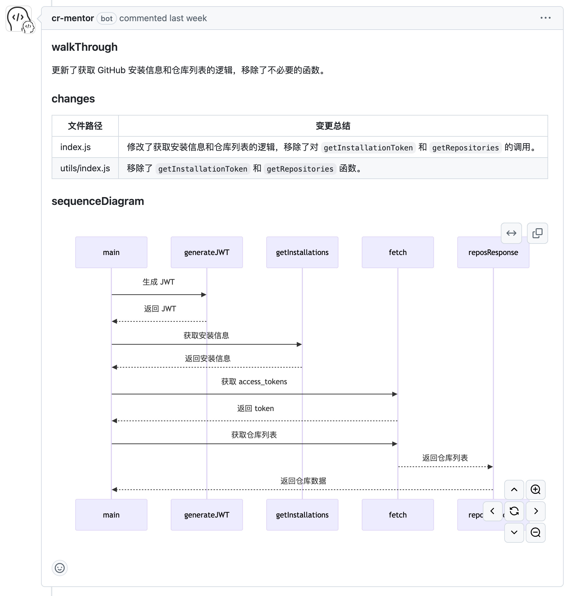
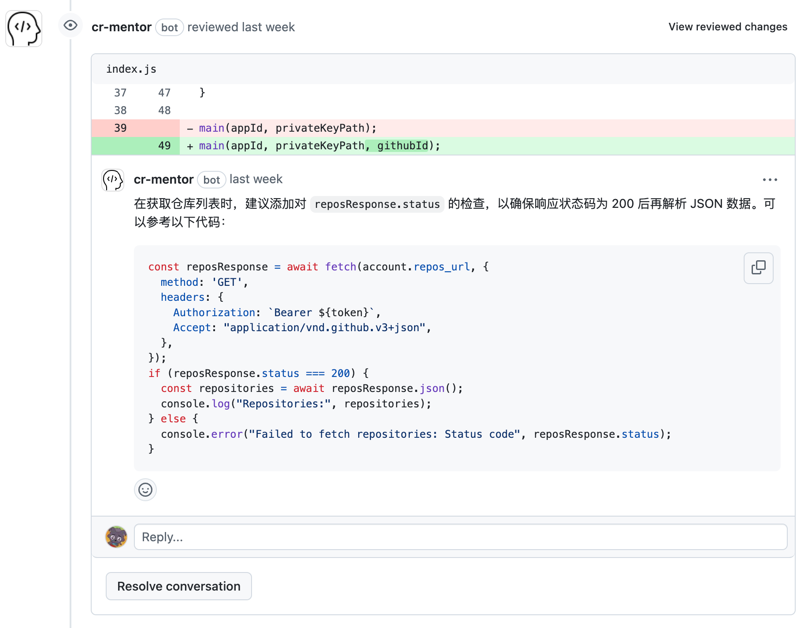

<div style="width: 100%; height: 420px; display: flex; justify-content: center; align-items: center; margin-bottom: 20px;">
  
</div>

<h1 align="center">基于知识库 + LLM 的 Code Review 导师</h1>

<div align="center">
  <a href="README.md"><strong>[English]</strong></a> ·
  <a href="README-zh_CN.md"><strong>[简体中文]</strong></a>
</div>

<div align="center" style="margin-top: 6px;">
  <strong>一个利用知识库 + LLM 帮助我们在 Code Review 提升研发效能的项目</strong>
</div>

## 在线体验

- 主页：[CR-Mentor](https://cr-mentor.top/)
- 代码审查演示：[Code Review Demo](https://github.com/Gijela/Auth-Github-App/pull/46)

## 亮点

1. 全面理解代码上下文  
   突破传统对 git diff 信息 CR 的局限, 通过 [github100](https://github.com/gijela/github100) 自动追踪代码变更涉及的所有相关文件，包括跨文件/模块的引用链路，实现对代码上下文与业务逻辑的全面理解

2. 代码规范自定义  
   基于知识库沉淀的最佳实践，支持自定义仓库级别的代码审查规范, 通过上传代码规范文件和闭源依赖详解文件, 有效解决 LLM 在处理闭源依赖/代码时的幻觉问题

3. 全局代码分析  
   通过 LLM 基于完整的链路代码上下文和代码变更，生成包含**代码演练**、**变更说明**和**时序图**的综合审查报告

4. 风险代码识别抛出  
   定制 Agent Tools, 识别存在潜在风险的变更，提供改进建议并且单独评论反馈

## 功能预览

1. 知识自动入库
   

2. 代码审查
   
   

## 本地开发

```bash
cd apps/admin

pnpm install
pnpm admin:dev
```

## 未来计划

- [ ] 制定人工干预机制，回收反馈，优化代码审查流程
- [ ] 专注开发者成长，分析优缺点，制定成长计划
- [ ] 支持 Gitlab 等其他平台

## Star History


## License

本仓库遵循 CR-Mentor Open Source License 开源协议。

允许作为后台服务直接商用，但不允许提供 SaaS 服务。  
未经商业授权，任何形式的商用服务均需保留相关版权信息。  
完整请查看 [Apache License 2.0](./LICENSE)  
联系方式：frontendgijela@gmail.com
