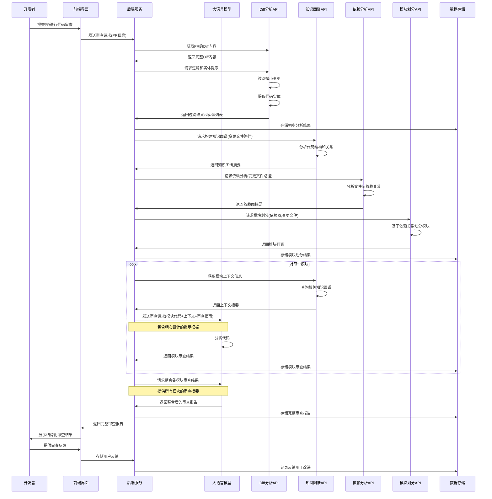

# CR 思路

## 初步过滤和实体提取

前端调用 `/github/createPullRequest` 创建 pull request, 从返回体中获取数据去调用 `/github/getDiffsDetails` 接口，从而获取到本次 pr 的 diffs 和 commits。
为了不超过大模型上下文限制，对 files 进行分组，按照 changes 字段进行分组，限制每组 changed 总和不超过 3000, 然后通过 Promise.all 并发调用 `/repo/filterDiffEntity` 大模型接口对 diffs 内容进行初步过滤(排除掉很小的变动，对复杂变动进行实体提取), 最终返回一个json数组对象(每一项是该diff文件的实体数组 entityList, 过滤后所有diff文件的最小根目录 miniCommonRoot )

```json
{
  //  "filteredSummary": "被过滤的diff内容的摘要",
  "miniCommonRoot": "src",
  "entityList": [
    {
      "file_path": "src/utils/stringUtils.ts",
      "entities": ["camelToSnake", "snakeToCamel"]
    },
    {
      "file_path": "src/services/userService.js",
      "entities": ["UserService", "getUserProfile", "updateUserProfile"]
    }
  ]
}
```

## 知识图谱构建 && 依赖关系图构建

将过滤后的所有diff文件的路径收归起来，作为构建图谱的入口文件 targetPaths。其中 targetPaths 类型为 string[]

1. 将仓库 url、branch、targetPaths、miniCommonRoot 作为参数，调用 `/repo/analyzeRepo` 接口，得到代码知识图谱 `knowledgeGraph` 和依赖关系图 `dependencyGraph`
2. 将 `knowledgeGraph` 、 `dependencyGraph` 和剩余的 diff 文件路径 `targetPaths` 返回给前端

## 依赖分析 & 划分模块处理

1. 在前端，将 `targetPaths` 和 `dependencyGraph` 作为参数，使用 `groupModulesByDependency` 方法进行划分功能模块，得到 `moduleList`

```json
{
  "moduleList": [
    [
      "repo/github101-J7tz/src/core/scanner.ts",
      "repo/github101-J7tz/src/core/error.ts",
      "repo/github101-J7tz/src/core/gitAction.ts"
    ],
    ["repo/github101-J7tz/src/utils/graphSearch.ts"]
  ]
}
```

2. 将每个模块的所有diff文件路径对应的所有实体数组，整合成一个实体数组，作为模块层面的实体数组，然后使用 `searchKnowledgeGraph` 方法，在 `knowledgeGraph` 中检索每个模块的实体数组，得到每个模块的上下文信息 `moduleContexts`

## Code Review

1. 将每个模块的上下文信息 `moduleContexts` 和当前模块内所有diff代码内容整合为一份用户提示词，提供给大模型进行Code Review，得到 Code Review 结果

## 时序图


