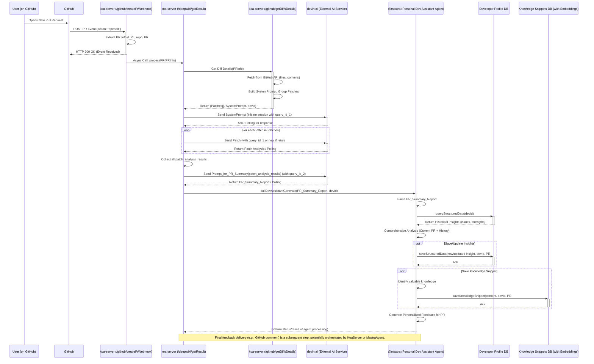

# Pull Request (PR) 自动化分析流程

本文档描述了当一个 Pull Request 被创建时，系统自动进行分析、生成反馈并沉淀知识的完整流程。

## 一、高层概述

当开发者在 GitHub 上打开一个新的 PR 时，系统会通过一系列自动化步骤进行处理：

1.  接收 GitHub Webhook 事件。
2.  获取 PR 的代码变更详情。
3.  利用外部 AI 服务 (`devin.ai`) 对代码变更进行初步分析和总结。
4.  触发个性化开发者助手 Agent (`@mastra`)。
5.  `@mastra` Agent 结合历史数据和知识库，进行深度分析，更新开发者画像和知识库。
6.  生成最终的个性化 PR 反馈。

## 二、详细步骤

### 步骤 1: PR 创建与 GitHub Webhook 触发

- **触发点**: 开发者在 GitHub 仓库中创建一个新的 Pull Request。
- **动作**:
  1.  GitHub 向预先配置在 `koa-server` 上的 Webhook URL 发送一个 `pull_request` 事件，其中 `action` 为 `opened`。
  2.  `koa-server` 中的 `/github/createPrWebhook` 接口接收到这个 Webhook 请求。
  3.  `createPrWebhook` 函数解析 `payload`，提取关键信息，如：
      - `compareUrl`: PR 对比的 URL。
      - `baseLabel`: 基础分支的标签。
      - `headLabel`: PR 源分支的标签。
      - `repo_name`: 仓库全名 (e.g., "owner/repo")。
      - `pull_number`: PR 编号。
      - `prTitle` (可选): PR 标题。
      - `prDesc` (可选): PR 描述。
  4.  `createPrWebhook` **异步调用**内部的 `/deepwiki/getResult` 接口，并将上述提取的信息作为参数传递。之后，它会立即响应 GitHub (通常是 HTTP 200)，表示事件已成功接收。

### 步骤 2: PR 数据获取与初步处理 (`/deepwiki/getResult` - 阶段一)

- **执行者**: `koa-server` 中的 `/deepwiki/getResult` 接口。
- **动作**:
  1.  调用 `koa-server` 内部的 `/github/getDiffsDetails` 接口。
  2.  `/github/getDiffsDetails` 负责：
      - 创建临时的 GitHub Token。
      - 使用 GitHub API (基于 `compareUrl`, `baseLabel`, `headLabel`) 获取 PR 的详细文件变更 (`files`，包含 `patch` 内容) 和提交信息 (`commits`)。
      - 根据 PR 标题、描述和提交信息构建一个初始的 "System Prompt" (`systemPrompt`)，用于引导后续与 AI 模型的交互。
      - 对获取到的 `files` (diff 内容) 进行智能分组 (`formatAndGroupDiff`)，将大型 PR 的 diff 拆分成多个 `patches` 块，以适应 AI 模型的上下文长度限制。
  3.  `/deepwiki/getResult` 接收到格式化后的 `patches` 数组、`systemPrompt` 以及 `github_node_id` (开发者的唯一标识，用于后续个性化处理)。

### 步骤 3: 核心 AI 分析 (`/deepwiki/getResult` - 阶段二，与 `devin.ai` 交互)

- **执行者**: `koa-server` 中的 `/deepwiki/getResult` 接口，通过调用外部 `devin.ai` 服务。
- **动作**:
  1.  **初始化 AI 会话**:
      - 生成一个唯一的 `currentQueryId`。
      - 调用 `initializeSessionWithSystemPrompt` 函数，该函数内部通过 `sendMessage` 将 `systemPrompt` 和 `currentQueryId` 发送给 `https://api.devin.ai/ada/query`。
      - 通过 `pollingResponse` 轮询 `devin.ai` 直到初始 `systemPrompt` 处理完成。
  2.  **遍历处理 Patches**:
      - 对于 `/github/getDiffsDetails` 返回的每一个 `patch` 块：
        - 调用 `sendMessage` 将当前 `patch` 内容和 `currentQueryId` 发送给 `devin.ai`。
        - 调用 `pollingResponse` 轮询 `devin.ai` 获取该 `patch` 的分析结果。
        - 收集所有 `patch` 的分析结果到 `chatResults` 数组。
      - **重试机制**: 如果处理某个 `patch` 失败，会生成新的 `query_id`，重新初始化会话并重试该 `patch` (有最大重试次数限制)。
  3.  **生成 PR 总结报告**:
      - 所有 `patches` 处理完毕后，使用 `buildPrSummaryPrompt` 函数，结合 `chatResults` 和已删除文件列表等信息，构建一个用于生成最终 PR 总结的 Prompt。
      - 生成一个新的 `summaryQueryId`。
      - 再次调用 `initializeSessionWithSystemPrompt`，将此总结性 Prompt 发送给 `devin.ai`，并轮询获取最终的 PR 总结报告 (`summaryContent`)。

### 步骤 4: 触发个性化开发者助手 Agent (`@mastra`)

- **执行者**: `koa-server` 中的 `/deepwiki/getResult` 接口。
- **动作**:
  1.  在成功获取到 `summaryContent` (PR 总结报告) 和 `github_node_id` (开发者 GitHub Node ID) 后。
  2.  调用 `callDevAssistantGenerate` 函数，并将 `summaryContent` 和 `github_node_id` 作为核心参数传递，从而激活 `@mastra` (Personal Dev Assistant Agent)。

### 步骤 5: `@mastra` Agent 进行深度分析与知识管理

- **执行者**: `@mastra` (Personal Dev Assistant Agent)，其逻辑定义在 `agent-server` (如 `agent-server/src/mastra/agents/personalDevAssistant/` 路径下)。
- **动作** (依据 `plan.md` 中的 "流程 A: 处理 PR 总结报告"):
  1.  **解析 PR 总结**: Agent 解析从 `/deepwiki/getResult` 传入的 `summaryContent`。
  2.  **查询历史洞察**: 调用 `queryStructuredDataTool`，使用 `developer_id` (`github_node_id`) 从 `developer_profile_data` 数据库表中检索该开发者过去的问题模式 (issues) 和技术优势 (strengths)。
  3.  **综合分析**: 结合当前 PR 的信息和历史洞察进行分析。
  4.  **(可选) 保存/更新结构化洞察**: 如果识别出新的或重复的问题/优势，调用 `saveStructuredDataTool` 将其保存或更新到 `developer_profile_data` 表，并关联当前 PR ID。
  5.  **(可选) 沉淀知识片段**: 判断当前 PR 分析中是否有值得长期保存的知识点（如解决方案、关键代码示例、避坑经验）。如果有，调用 `saveKnowledgeSnippetTool`:
      - 为知识内容生成 embedding (使用如 `text-embedding-3-small`)。
      - 将知识内容、embedding、开发者 ID、来源 PR 等信息存入 `knowledge_snippets` 数据库表。
  6.  **生成个性化反馈**: 基于当前 PR 的分析结果、开发者的历史洞察以及从知识库中可能检索到的相关信息，生成最终的、个性化的 PR 反馈。

### 步骤 6: 反馈呈现

- **执行者**: 具体实现可能依赖于 `@mastra` Agent 的后续动作或 `koa-server` 的进一步处理。
- **动作**:
  - `@mastra` Agent 生成的个性化反馈，可能会通过以下方式之一或组合呈现给用户：
    - 自动发布为 GitHub PR 的评论。
    - 通过内部通知系统发送给相关开发者。
    - 存储起来供后续查阅。
  - (此步骤的具体实现细节未在当前分析的代码中完全明确，但为完整流程的合理推断)。

## 三、关键组件

- **GitHub**: PR 的源头和事件触发器。
- **`koa-server`**:
  - `/github/createPrWebhook`: Webhook 接收与初步分发。
  - `/deepwiki/getResult`: 核心流程编排，与 `devin.ai` 交互获取初步分析和总结。
  - `/github/getDiffsDetails`: 从 GitHub API 获取 PR 详细数据。
  - `callDevAssistantGenerate`: 触发 `@mastra` Agent。
- **`devin.ai` API**: 外部 AI 服务，执行代码分析和文本生成任务。
- **`@mastra` (Personal Dev Assistant Agent)**:
  - 执行深度分析，结合历史数据。
  - 管理开发者画像 (问题模式、技术优势)。
  - 管理个人知识库 (解决方案、经验沉淀)。
  - 生成最终的个性化反馈。
- **数据库**:
  - `developer_profile_data`: 存储结构化的开发者洞察 (问题、优势)。
  - `knowledge_snippets`: 存储可检索的知识片段及其 embeddings。

## 四、PR 分析流程时序图

